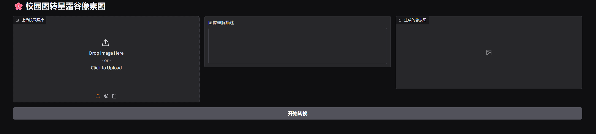
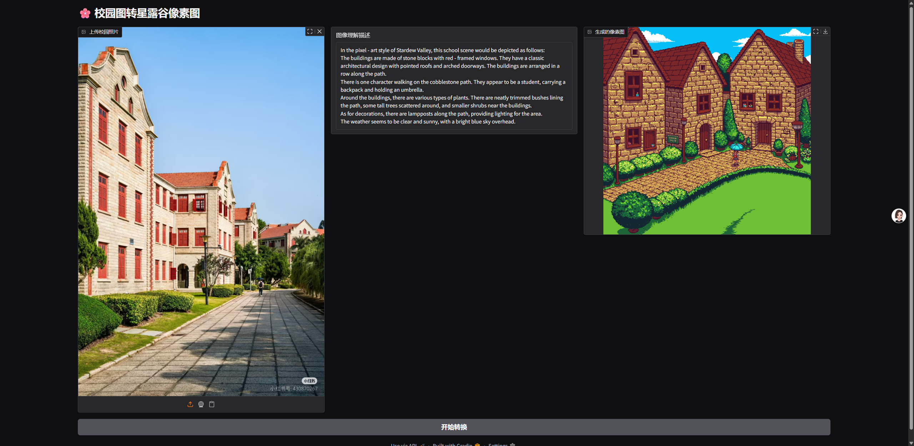

## 校园星露谷开发手册

### 配置环境

1. 创建虚拟环境

```bash
conda create -n valley python=3.12
```

2. 下载必要的库文件

   ```bash
   pip install gradio websocket dwspark
   ```
3. 运行gradio界面

   使用配置好的conda环境运行app.py


## 校园星露谷使用手册

### 项目介绍

我们打造了一款将现实校园融入《星露谷物语》奇幻像素世界的创意项目。用户只需上传教学楼、林荫道、操场等校园场景照片，AI引擎将自动进行风格迁移处理，用标志性的16-bit手绘风格重构画面，让熟悉的场景瞬间披上童话滤镜。当您解锁图书馆、教学楼等多个经典地标时，将收获对应成就徽章；特别设置的"四季彩蛋"功能，能让同一场景随现实季节变换呈现不同像素特效：春日飘落的樱花雨、冬季屋檐的积雪粒子都藏着惊喜。（后续添加）通过游戏化探索，我们希望在保留校园记忆真实坐标的同时，为每个使用者搭建起连接现实与幻想世界的桥梁，让青春记忆以更浪漫的方式永存。

### 界面介绍

下面就是我们的项目界面，左侧可以上传您的显示校园，中间会生成您的图片描述，右侧会显示生成的校园星露谷。



上传玩图片后，即可点击开始转换，然后将生成校园星露谷。


